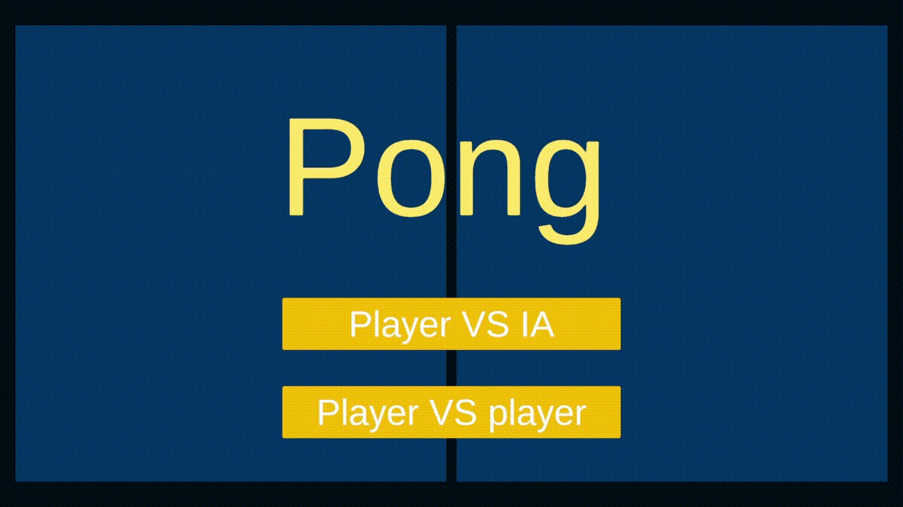

# Classic Pong 

> A rapid 3-hour prototype of the classic Pong game, built for both mobile and PC.  
> Includes AI opponent and local 2-player mode.

---

## Features 
- **Two game modes:** 
  - Single-player vs AI.
  - Local 2-player multiplayer.
- **Cross-platform support:** Playable on PC and mobile devices.
- **Simple and fast prototype:** Completed in just 3 hours.

---

## Development Context 
- Created as a speed prototype to practice core mechanics and input handling across multiple platforms.

---

## My Contribution 
- Implemented full gameplay logic (paddle movement, ball physics, scoring system).
- Added AI opponent behavior and 2-player mode.
- Integrated input handling for both PC (keyboard) and mobile (touch).

---

## Screenshots / GIFs 
*(Replace with your own images or GIFs)*  
Example:  

---

## How to Play 
### Controls (PC)
- Player 1: `W` / `S` to move up/down  
- Player 2: `Up Arrow` / `Down Arrow` to move up/down

### Controls (Mobile)
- Touch input zones for paddle movement.

### Installation
1. Download the latest [release](https://github.com/NikolasH03/Pong/releases/tag/V1.0.0).
2. Extract and run the `.exe` (PC) or install the `.apk` (mobile).

---

## Project Status 
**Prototype completed**  
Focused on rapid development and gameplay experimentation.

---

## Credits 
- **Nicolás Hurtado** – Programming & integration.

---

## License 
This project is published for portfolio purposes only.  
The code and assets are not licensed for commercial use.
